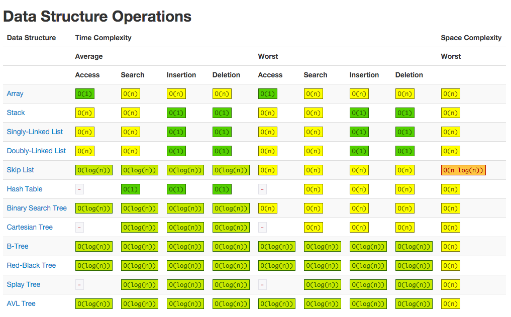

# Data Structures in JavaScript (ES5 and ES6)

## The data structures in the series

* [x] Array
* [x] Set
* [x] Stack
* [x] Queue
* [x] Singly Linked List
* [x] Doubly Linked List
* [x] Hash Table
* [x] Tree
* [x] Binary Search Tree
* [x] Trie
* [x] Graph

## The big O notation

The complexity is usually expressed with the [Big O notation](https://en.wikipedia.org/wiki/Big_O_notation). The wikipedia page about this subject is pretty complex but you can find here a good summary of the [different complexity for the most famous data structures and sorting algorithms](http://bigocheatsheet.com/).

